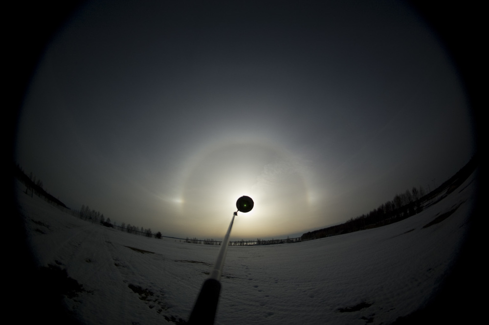
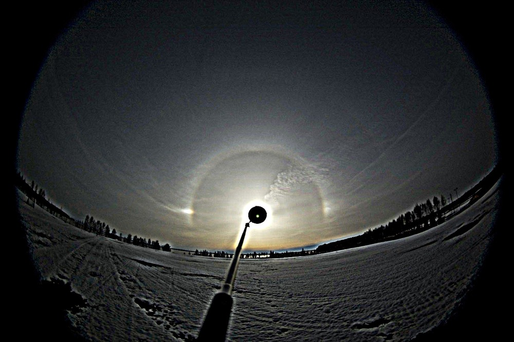
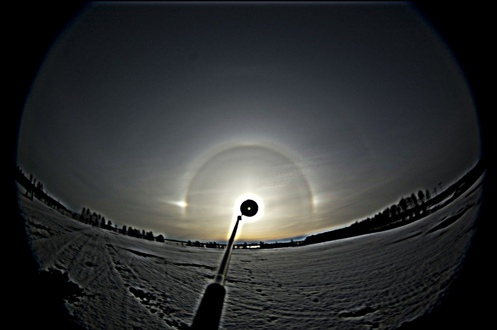
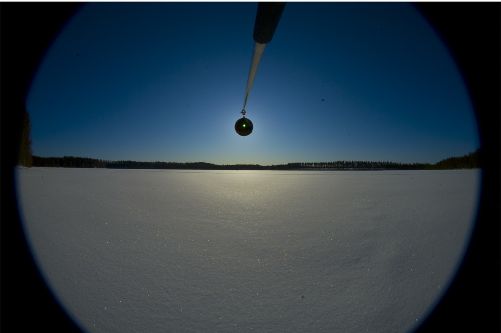
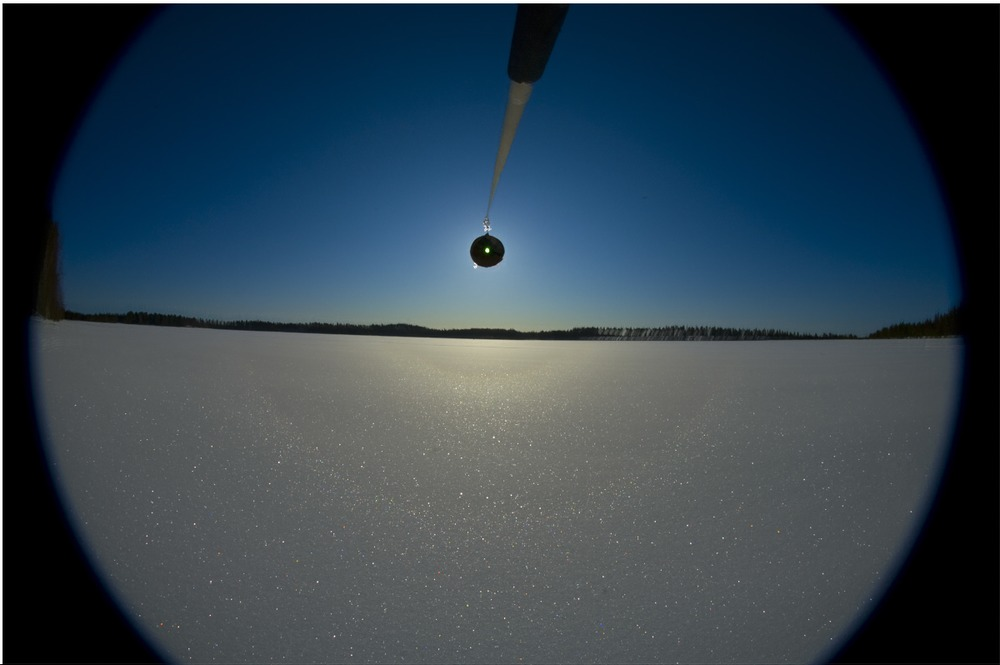
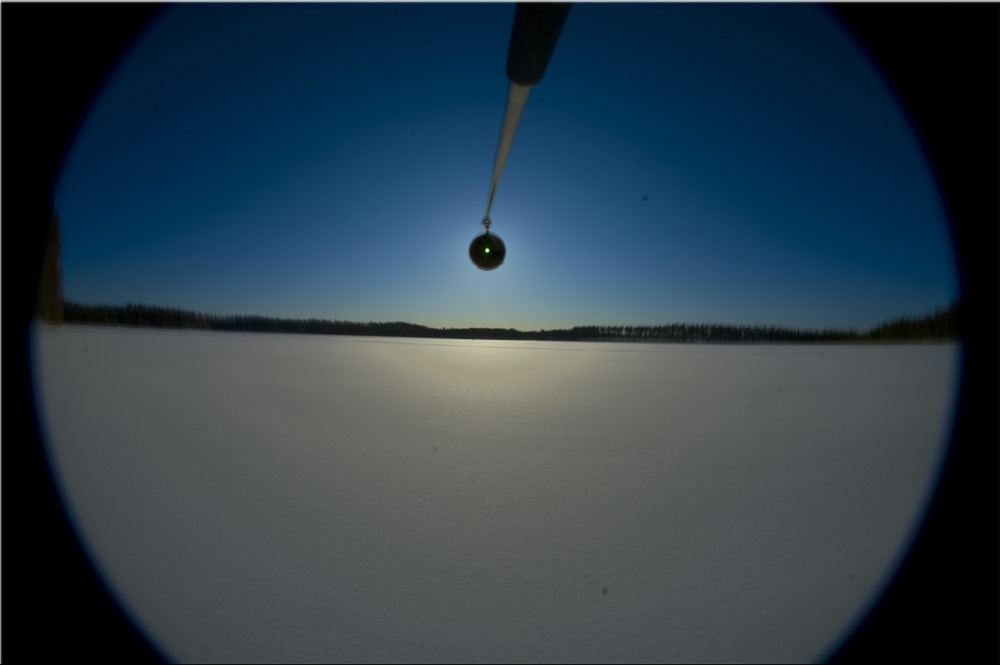
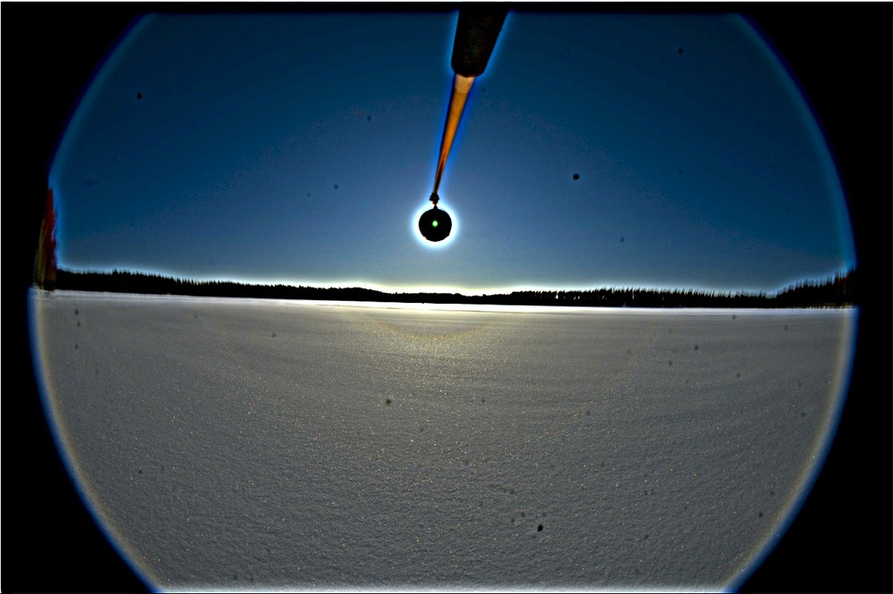
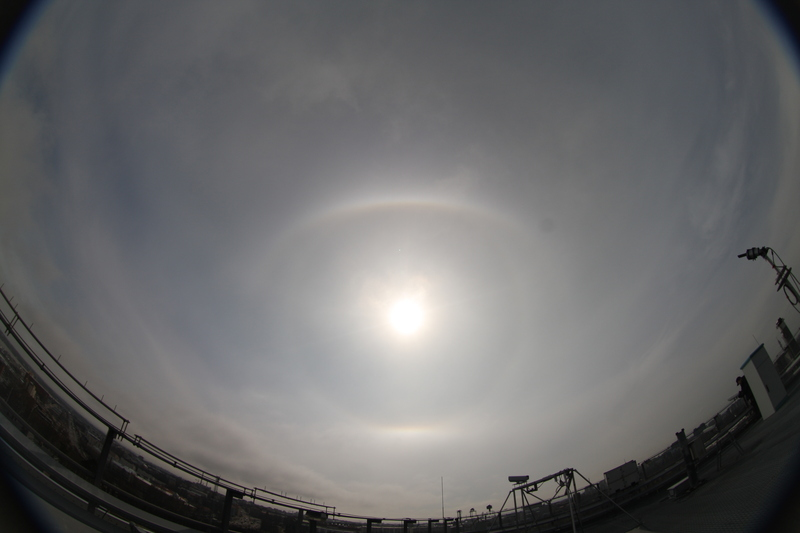
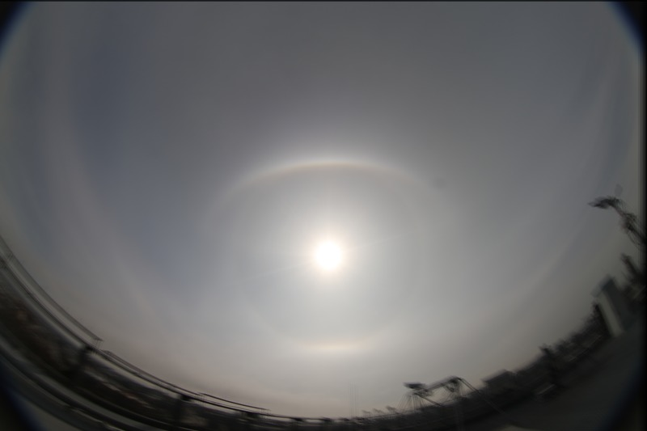
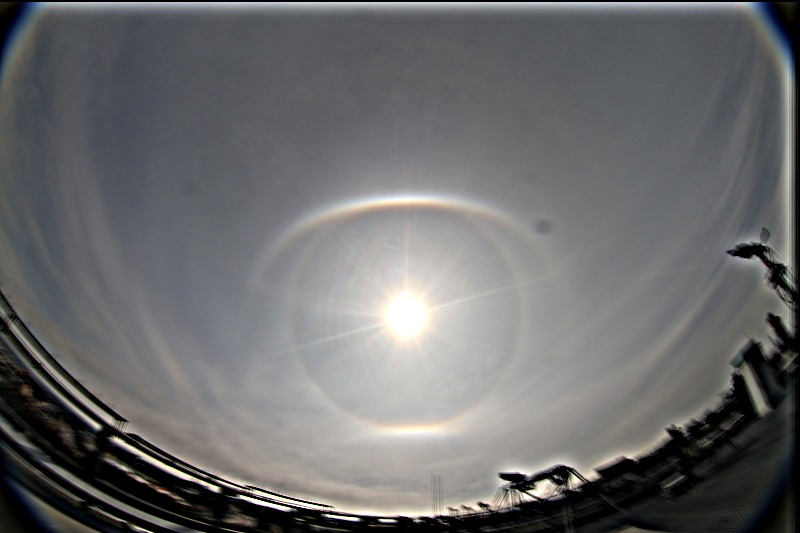

Examples
--------

This page shows few examples of how the stacking is used for image
sequences of halo displays.

Pyramid halo display
____________________

A pyramid halo display from April 20, 2012 by Marko Riikonen.

Files
=====

Download input images from here: riikonen1.zip_.

Command
=======

Generate average stack::

  $ halostack_cli.py -a riikonen_ave_stack.png DSC_*

Apply unsharp mask::

  $ halostack_cli.py -a riikonen1_ave_stack_usm.png -e usm:40,8 riikonen_ave_stack.png

Results
=======

Single image enhanced with USM.

Stack enhanced with USM.

Surface halo display
____________________

A surface halo display from April 9, 2012 by Marko Riikonen.  For
surface halos, maximum stack typically reveals the halos better than
average stack.  Here we'll generate both, and also apply USM to the
average stack.

Files
=====

Download input images from here: riikonen2.zip_.

Command
=======

Generate maximum and average stacks::

  $ halostack_cli.py -M riikonen2_max_stack.png -a riikonen2_ave_stack.png U*jpg

Apply unsharp mask sharpening to the average stack::

  $ halostack_cli.py -a riikonen2_ave_usm.png -e usm:30,8 riikonen2_ave_stack.png

Results
=======

Maximum stack.

Average stack.

USM enhanced Average stack.

No blocker
__________

In this display, no blocker was used, so the reference selection needs
to be much larger and the alignment takes more time.  Images by Panu
Lahtinen, April 23, 2015.

Files
=====

Download input images from here: lahtinen1.zip_.

Commands
========

Generate average stack::

  $ halostack_cli.py -a lahtinen1_ave_stack.png 2012*jpg

Apply USM::

  $ halostack_cli.py -a lahtinen1_ave_stack_usm.png -e usm:20,8 lahtinen1_ave.png

Results
=======

Average stack.

Unsharp mask enhanced average stack.

.. _riikonen1.zip: http://www.puuppa.org/~pnuu/halostack/riikonen1.zip
.. _riikonen2.zip: http://www.puuppa.org/~pnuu/halostack/riikonen2.zip
.. _lahtinen1.zip: http://www.puuppa.org/~pnuu/halostack/lahtinen1.zip
