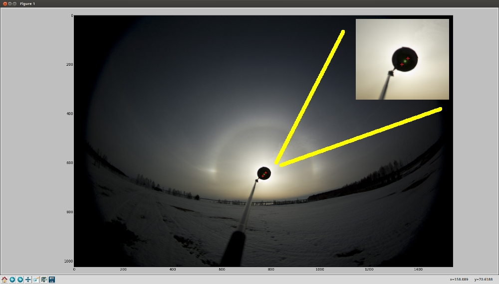
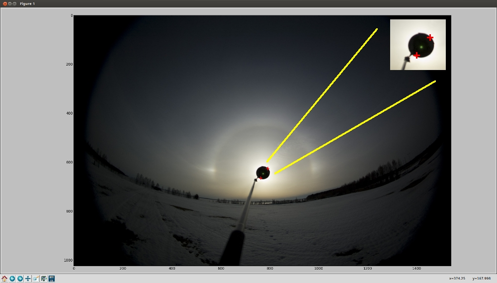

.. .. sectnum::
..   :depth: 4
..   :start: 2
..   :suffix: .

.. _string-format: https://docs.python.org/2/library/string.html#format-string-syntax

Usage
-----

Command-line interface ``halostack_cli.py`` to Halostack libraries is
available in the ``bin/`` directory.  There is also a very simple
example how to generate B-R processed image, ``halostack_br.py``.

Basic usage
___________

As a first step, we'll show how the alignment reference is selected
from the first image in the stack.  To start, issue the following command::

  $ halostack_cli.py -a average_stack.png *.jpg

You'll get a new window showing the first image:

It is usually helpful first to expand the window to full screen.

From the image, we need to click the two corner points of the area
having the Sun.  These points are marked with plus-signs, and the
image will be closed after the second point has been selected.  Try to
select the points so that the area is as tightly around the Sun as
possible, but still so that there's some black from the blocker
included in the area.

Simililarly, we need to select the area where this reference area will
be searched from in the following images:

This area needs to be larger than the reference area.  In northern
hemishphere, the Sun (and Moon) moves towards right, so with a image
series photographed using a tripod we don't need to add much extra
area on the left side of the reference.  There's a tradeoff in the
area size: The smaller the area is, the faster the alignment will be.
But if the area is too small, the reference might not be inside the
area, and that image will not be used in the stack.  Or even worse,
there's a similar area with good enough correlation and that feature
is selected, ruining the whole stack.

Command-line options
____________________

``python bin/halostack_cli.py [options] <list of filenames>``

- ``-a, --average-stack``

  - ``-a average_stack.png``
  - output filename of the average stack

- ``-m, --min-stack``

  - ``-m minimum_stack.png``
  - output filename of the minimum stack

- ``-M, --max-stack``

  - ``-M maximum_stack.png``
  - output filename of the maximum stack

- ``-d, --median-stack``

  - ``-d median_stack.png``
  - output filename of the median stack

- ``-t, --correlation-threshold``

  - ``-t 0.9``
  - minimum required correlation
  - default: 0.7

- ``-s, --save-images``

  - ``-s aligned_images_``
  - save aligned images as PNG with the given filename prefix
  - this will save the images with filenames like ``aligned_images_IMG_0001.png`` etc.

- ``-n, --no-alignment``

  - ``-n``
  - stack without alignment
  - no arguments

- ``-e, --enhance-images``

  - ``-e gradient:20``
  - enhancement functions applied to each input image before alignment and stacking
  - can be called several times
  - processing is done in the given order

- ``-E, --enhance-stacks``

  - ``-E usm:25,2``
  - enhancement functions applied to each stack
  - can be called several times
  - processing is done in the given order

- ``-g, --view-gamma``

  - ``-g 1.5``
  - adjust image gamma for alignment preview
  - default: 1.0

- ``-C, --config``

  - ``-C config.ini``
  - use config file <file>

- ``-c, --config_item``

  - ``-c default``
  - select the config item to use

- ``-l, --loglevel``

  - ``-l debug``
  - ``-l info``
  - ``-l warning``
  - ``-l error``
  - set the level of messages

- ``<list of filenames>``

  - ``*.jpg``
  - ``images/*.*``
  - ``IMG_0001.jpg IMG_0002.jpg IMG_0003.jpg``

Configuration file
__________________

Everything that can be set with the command-line options can also be
setup in a configuration file.  Command-line options will override
settings obtained from the configuration file.

Below is an example configuration::

    # average stack from raw/tiff images with view gamma set
    [avg_from_raw]
    average_stack = average.png
    view_gamma = 1.5

    # average stack from raw/tiff images with view gamma set and USM applied to the stack
    [avg_from_raw]
    average_stack = average.png
    view_gamma = 1.5
    enhance_stacks = usm:25,2

    # B-R processing without stacking and less output
    [br]
    no_alignment = 
    enhance_stacks = gradient br
    loglevel = warning

These pre-set configurations can be used like this::

    $ halostack_cli.py -C <configuration file> -c <config item>

For example, using the B-R configuration defined above::

    $ halostack_cli.py -C config.ini -c br

Image processing options
________________________

This *tries* to be a complete list of image pre- and post-processing
options available in Halostack.  These enhancements can be applied
using ``-e`` and ``-E`` command-line switches, or corresponding
configuration file options ``enhance_images`` and ``enhance_stacks``.
All the examples on the green background are used in conjunction with
these switches (eg. ``-e br``) or given in configuration file.

It is recommended that ImageMagick based methods are used before Numpy
based in *preprocessing*, and vice versa in *postprocessing*.  In this way
there's less switching between floating point (Numpy) and integer
(ImageMagick) datatypes and less loss in data.

ImageMagick based methods
=========================

These methods rely on ImageMagick processing functions.  For these to
work, the image data needs to be converted to a format recogniced by
ImageMagick, so some of the otherwise available data may be lost if
the data was previously manipulated using floating point operators.

Unsharp mask
++++++++++++

Unsharp mask, or USM in short, is a way to enhance halos by increasing
the image contrast.

The user can give the USM four parameters:

* radius of the applied Gaussian blur in pixels

  * this should be about the same as the dimension of the halos,
    eg. the width of parhelic circle

* amount

  * fraction of the difference between the original and the blurred
    image that is added back into the original
  * start testing with values around ``4`` or ``5``

* sigma

  * standard deviation of the Gaussian in pixels
  * optional, defaults to ``sqrt(radius)``

* threshold

  * threshold above which the USM is applied
  * given as a fraction of the maximum pixel value

    * ``0.05`` would mean pixel values above 11.8 for 8-bit and 3275.8
      for 16-bit images

  * optional, defaults to ``0.0`` meaning that USM is applied everywhere

The syntax is::

  usm:radius,amount,sigma,threshold

where ``sigma`` and ``threshold`` are optional::

  usm:25,5
  usm:30,4,15
  usm:40,5,20,0.05

Emboss
++++++

Emboss makes a relief of the image based on local contrast.  In some
cases this can show the halos more clearly.

Syntax::

  emboss:azimuth,elevation

where ``azimuth`` (default: ``90``) and ``elevation`` (default:
``45``) are *optional* arguments giving the location of the light
source in degrees.

Syntax::

  emboss
  emboss:90
  emboss:90,45

The smaller the elevation value, the longer the "shadow" is behind the
halos.  The *azimuth* can be adjusted to best effect to reflect the
orientation of the halos.

Numpy based methods
===================

These methods are written using mathematical functions available in
the Numpy Python library.

Blue - Red
++++++++++

This method is described in detail by Lefadeux_.  In short, the idea
is to reduce the effect of the background to enhance the colorful
(non-white) halos by subtracting red channel data from the
appropriately scaled blue channel.

In Halostack, the procedure is highly automatized, but the user still
has some possibilities to make adjustments.  The basic usage is to let
Halostack determine the scaling value (restricted to be between 1.5
and 2.5)::

  br

It is also possible to give the multiplier::

  br:1.5

To make the iteration by trial-and-error a bit faster, it is suggested
to check what is the initial estimate from the automatic version.

Green - Red
+++++++++++

The Green - Red method is otherwise equal to the Blue - Red method described
above, but in this case the first channel is different.

Syntax::

  gr
  gr:1.5

Gradient removal
++++++++++++++++

Sky tends to have gradients.  This method tries to reduce their effect
by applying a blur to the luminance of the image and subtracting this
from all the color channels.  By default the blur radius is 1/20th of
the smaller image dimension::

  gradient

The radius can be given as a parameter::

  gradient:50

Also other methods for gradient removal are implemented, but they are
not currently exposed via the command-line client.

Luminance subtraction
+++++++++++++++++++++

Luminance subtraction is also described in the magnificient article by
Lefadeux_.  The implementation generates a image by subtracting the
luminance (average of the color channels) from the whole image.  No
arguments are used.

Syntax::

  rgb_sub

RGB mixing
++++++++++

To augment the Luminance subtraction, it is also possible to directly
mix the luminance subtracted image with the original image.  The
mixing ratio can be given, and if omitted, value of ``f = 0.7`` is
used.

``image = (1-f) * original + f * rgb_sub``

Syntax::

  rgb_mix
  rgb_mix:0.5

Linear stretching
+++++++++++++++++

In many cases the image data has lots of "empty" in both ends of the
histrogram.  With this method, it is possible to truncate the data so
that more of the useful data is retained in the output image.  User
can supply the fractions of the histogram that are truncated at each
end. 

If the values are not given, ``1 %`` (or ratio of ``0.01``) of
the data is cut from each end::

  stretch

which is equal to::

  stretch:0.01,0.99

If only one value is given, the higher value is complement of this
value, eg.::

  stretch:0.02

is equal to::

  stretch:0.02,0.98

.. _Lefadeux: http://opticsaround.blogspot.fr/2013/03/le-traitement-bleu-moins-rouge-blue.html
