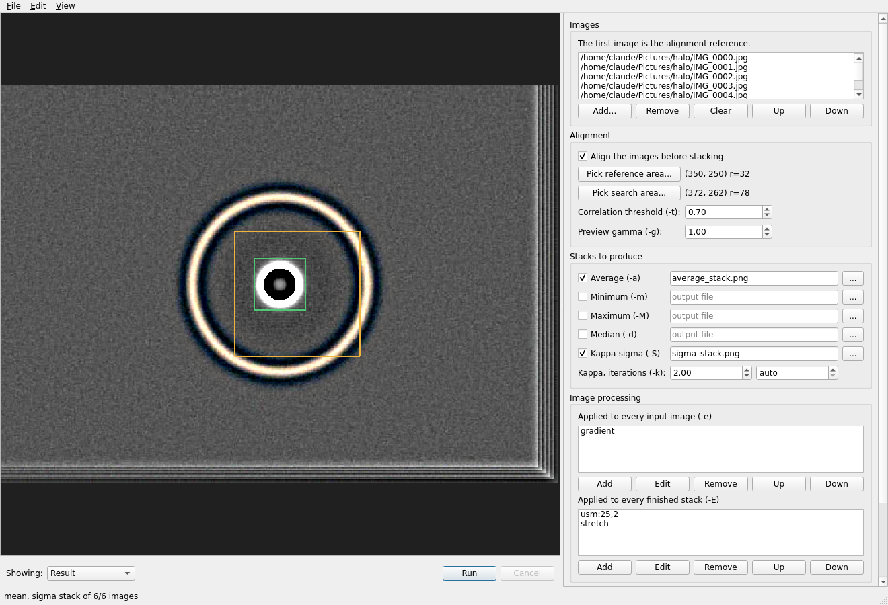
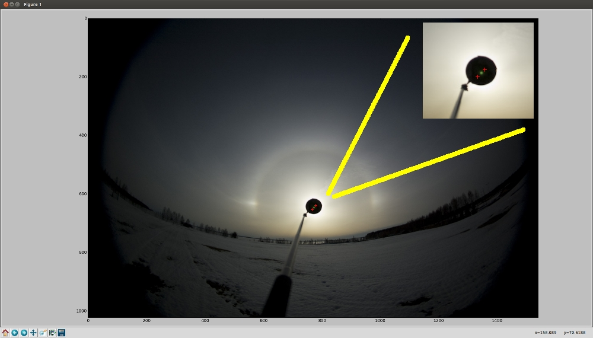
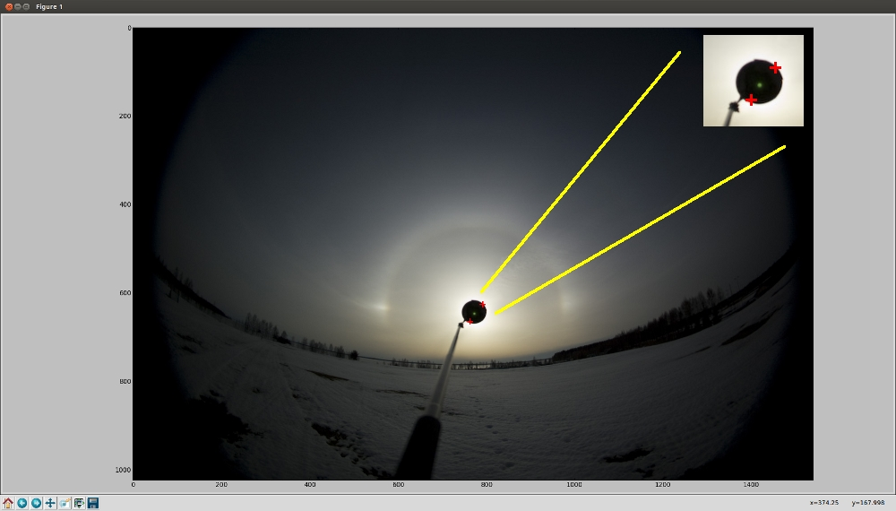

.. .. sectnum::
..   :depth: 4
..   :start: 2
..   :suffix: .

.. _string-format: https://docs.python.org/2/library/string.html#format-string-syntax

Usage
-----

Halostack has two interfaces, and one command chooses between them::

  $ halostack                       # opens the window
  $ halostack IMG_*.jpg             # opens the window with those images
  $ halostack -a average.png *.jpg  # does the work and exits

An option means "do this now", so anything with a switch on it runs on the
command line.  Nothing but filenames, or nothing at all, opens the window.
``--gui`` forces the window even when options are given, filling the controls
in from them, and ``--cli`` (or ``--no-gui``) forces the command line.
``--help`` and ``--version`` always answer on the command line.

``halostack_cli`` is always the command line and ``halostack_gui`` is always
the window, whatever the arguments; scripts written against earlier versions
can keep calling ``halostack_cli``.

The window
__________

         settings on the right.

Everything below can be set in the window as well, and the layout follows the
same order: the images, the alignment, the stacks to produce, the image
processing, and the output settings.  The image being worked on is shown on
the left of a divider that can be dragged to give either side more room.

Above, six exposures have been aligned on the Sun and combined into an average
and a kappa-sigma stack, with the background gradient removed from each
exposure and an unsharp mask and a linear stretch applied to the result.  The
green box is the alignment reference and the orange one the area it is
searched for in each of the remaining exposures.

Alignment areas are dragged out on the preview rather than clicked as two
corners: press *Pick reference area*, drag a box around the Sun, then press
*Pick search area* and drag the larger box.  Both outlines stay on the image.

Nothing is computed until *Run* is pressed, and a run can be stopped with
*Cancel*.  A finished stack replaces the preview; *Undo* in the Edit menu goes
back to the previous one, so a stack that came out worse than the last can be
taken back.

There is also a very simple example of how to generate a B-R processed image,
``halostack_br``.

Basic usage
___________

As a first step, we'll show how the alignment reference is selected
from the first image in the stack.  To start, issue the following command::

  $ halostack -a average_stack.png *.jpg

You'll get a new window showing the first image:

It is usually helpful first to expand the window to full screen.

From the image, we need to click the two corner points of the area
having the Sun.  These points are marked with plus-signs, and the
image will be closed after the second point has been selected.  Try to
select the points so that the area is as tightly around the Sun as
possible, but still so that there's some black from the blocker
included in the area.

Simililarly, we need to select the area where this reference area will
be searched from in the following images:

This area needs to be larger than the reference area.  In northern
hemishphere, the Sun (and Moon) moves towards right, so with a image
series photographed using a tripod we don't need to add much extra
area on the left side of the reference.  There's a tradeoff in the
area size: The smaller the area is, the faster the alignment will be.
But if the area is too small, the reference might not be inside the
area, and that image will not be used in the stack.  Or even worse,
there's a similar area with good enough correlation and that feature
is selected, ruining the whole stack.

The reference is found with a single correlation over the whole search area,
so a larger area costs little; keeping it small still helps by making a wrong
match less likely.  See the ``-p`` commandline option for stacking several
exposures at a time.

Commandline options
___________________

``halostack_cli [options] <list of filenames>``

- ``-a, --average-stack``

  - ``-a average_stack.png``
  - output filename of the average stack

- ``-m, --min-stack``

  - ``-m minimum_stack.png``
  - output filename of the minimum stack

- ``-M, --max-stack``

  - ``-M maximum_stack.png``
  - output filename of the maximum stack

- ``-d, --median-stack``

  - ``-d median_stack.png``
  - output filename of the median stack

- ``-S, --sigma-stack``

  - ``-S sigma_stack.png``
  - output filename of the sigma clipped average stack

- ``-k, --kappa-sigma-params``

  - ``-k <kappa>,<iterations>``
  - parameters for the sigma clipped average stack
  - kappa: threshold how many standard deviations are allowed
  - iterations: how many iterations to perform
  - eg. ``-k 2.2,3`` removes all data from stack where value is more than 2.2 standard deviations from the average, and runs maximum of three iterations over the stack
  - default: ``2.0,max(1, <number_of_images>/8)``

- ``-t, --correlation-threshold``

  - ``-t 0.9``
  - minimum required correlation
  - default: ``0.7``

- ``-s, --save-images``

  - ``-s aligned_images_``
  - save aligned images as PNG with the given filename prefix
  - this will save the images with filenames like
    ``aligned_images_IMG_0001.png`` etc.

- ``-n, --no-alignment``

  - ``-n``
  - stack without alignment
  - no arguments

- ``-e, --enhance-images``

  - ``-e gradient:20``
  - enhancement functions applied to each input image before alignment
    and stacking
  - can be called several times
  - processing is done in the given order

- ``-E, --enhance-stacks``

  - ``-E usm:25,2``
  - enhancement functions applied to each stack
  - can be called several times
  - processing is done in the given order

- ``-g, --view-gamma``

  - ``-g 1.5``
  - adjust image gamma for alignment preview
  - default: ``1.0``

- ``-C, --config-file``

  - ``-C config.ini``
  - read settings from this configuration file
  - anything given on the command line wins over the file
  - ``--config_file`` is kept as an alias for the older spelling

- ``-c, --config-item``

  - ``-c default``
  - select the section of the configuration file to use
  - without it, the ``[default]`` section is used
  - ``--config_item`` is kept as an alias for the older spelling

- ``-p, --nprocs``

  - ``-p <num>``
  - ``-p 4``
  - number of worker threads used to overlap the per-image work: reading,
    aligning and enhancing several exposures at a time
  - the work inside one image is not divided, so this helps most when there
    are many exposures to get through
  - default: ``1``
  - works the same on every platform; the old restriction to one processor on
    Windows is gone

- ``<list of filenames>``

  - ``*.jpg``
  - ``images/*.*``
  - ``IMG_0001.jpg IMG_0002.jpg IMG_0003.jpg``

Different stacks
________________

Average
=======

- Commandline option: ``-a average.png``

In this stacking mode the images (after possible alignment) are simply
averaged: the sum of the exposures divided by how many were used.  This is
the most common one to use, as it smoothens the cloud movements and lowers
the noise.

Minimum
=======

- Commandline option: ``-m minimum.png``

Collects the minimum value for each pixel from the images.  Maybe not
that useful for halo photographs, but might still be useful for special cases.

Maximum
=======

- Commandline option: ``-M maximum.png``

Collects the maximum value for each pixel from the images.  Most
common use for this stack type is surface halos, where it's nice to
get all the distinct rays maximally visible.

Median
======

- Commandline option: ``-d median.png``

Calculates the median value from the images for each pixel.

**NOTE**: This method keeps all the images in memory, so it's a good
idea to scale the images to smaller size.

Sigma-clipped average
=====================

- Commandline option: ``-S sigma.png``

Calculates average of the images, but first discards outliers (too
small and/or large values) iteratively.  Discarding is done in the
following way:

1. calculate the average and the standard deviation of the stack for each
   pixel location
2. find the values that differ from that average by more than *kappa*
   standard deviations
3. mask these values
4. repeat until no data are discarded or maximum iterations are reached

The average of whatever is left is the result.  A pixel is never left with
nothing to average: if every value at a location would be rejected, the
previous set is kept instead.

User can supply the maximum deviation (kappa) and number of iterations
using commandline option ``-k``.  If these are not given, values kappa
= 2.0 and <number of images>/8 iterations are used.

**NOTE**: This method keeps all the images in memory, so it's a good idea to
scale the images to smaller size.

Configuration file
__________________

Everything that can be set with the commandline options can also be
setup in a configuration file.  Commandline options will override
settings obtained from the configuration file.

Below is an example configuration::

    # average stack from raw/tiff images with view gamma set
    [avg_from_raw]
    avg_stack_file = average.png
    view_gamma = 0.45

    # average stack from linear raw/tiff images with view gamma set
    # and USM applied to the stack
    [avg_from_raw]
    avg_stack_file = average.png
    view_gamma = 0.45
    enhance_stacks = usm:25,2

    # B-R processing without stacking
    [br]
    avg_stack_file = ave_stack_with_br.png
    no_alignment = True
    enhance_stacks = gradient br

These pre-set configurations can be used like this::

    $ halostack_cli -C <configuration file> -c <config item>

For example, using the B-R configuration defined above::

    $ halostack_cli -C config.ini -c br

Image processing options
________________________

This *tries* to be a complete list of image pre- and post-processing
options available in Halostack.  These enhancements can be applied
using ``-e`` and ``-E`` commandline options, or corresponding
configuration file options ``enhance_images`` and ``enhance_stacks``.
All the examples on the green background are used in conjunction with
these switches (eg. ``-e br``) or given in configuration file.

All methods work on floating point data from the moment an image is read
until the moment it is saved, so they can be combined in any order without
losing precision.  Earlier versions of Halostack passed some of these
operations to ImageMagick, which meant converting the data to 8- or 16-bit
integers and back; the order of the methods mattered as a result, and it no
longer does.

The one ordering rule left is that the channel differences (``br``, ``gr``
and ``bg``) produce a single-channel image, so nothing that needs colour can
follow them.

Sharpening and shading
======================

These methods were previously computed by ImageMagick and are now computed
with SciPy.  They produce the same kind of result from the same arguments.

Unsharp mask
++++++++++++

Unsharp mask, or USM in short, is a way to enhance halos by increasing
the image contrast.  USM is mostly used in *postprocessing* with
``-E`` commandline switch, but some use it also in *preprocessing*.

The user can give the USM four parameters:

* radius, the size of the detail to enhance, in pixels

  * this should be about the same as the dimension of the halos,
    eg. the width of parhelic circle
  * it sets the width of the Gaussian, as ``sigma`` below, unless that is
    given explicitly

* amount

  * fraction of the difference between the original and the blurred
    image that is added back into the original
  * start testing with values around ``4`` or ``5``

* sigma

  * standard deviation of the Gaussian in pixels
  * optional, defaults to ``sqrt(radius)``

* threshold

  * threshold above which the USM is applied
  * given as a fraction of the maximum pixel value

    * ``0.05`` would mean pixel values above 11.8 for 8-bit and 3275.8
      for 16-bit images

  * optional, defaults to ``0.0`` meaning that USM is applied everywhere

The syntax is::

  -E usm:radius,amount,sigma,threshold

where ``sigma`` and ``threshold`` are optional::

  -E usm:25,5
  -E usm:30,4,15
  -E usm:40,5,20,0.05

Emboss
++++++

Emboss makes a relief of the image based on local contrast.  In some
cases this can show the halos more clearly.  Emboss is used in
postprocessing with ``-E`` commandline switch.

Syntax::

  -E emboss:azimuth,elevation

where ``azimuth`` (default: ``90``) and ``elevation`` (default:
``10``) are *optional* arguments giving the location of the light
source in degrees.

Syntax::

  -E emboss
  -E emboss:90
  -E emboss:90,20

The smaller the elevation value, the longer the "shadow" is behind the
halos and the higher the contrast.  The *azimuth* can be adjusted to
best effect to reflect the orientation of the halos.

Use of *linear stretching* (``stretch``, see below) is usually helpful::

  -E emboss -E stretch

Colour and background methods
=============================

These methods work on the colour channels or on the background level.

Blue - Red
++++++++++

This method is described in detail by Lefadeux_.  In short, the idea
is to reduce the effect of the background to enhance the colorful
(non-white) halos by subtracting red channel data from the
appropriately scaled blue channel.

Blue - Red is a *postprocessing* method.

In Halostack, the procedure is highly automatized, but the user still
has some possibilities to make adjustments.  The basic usage is to let
Halostack determine the scaling value (restricted to be between 1.5
and 2.5)::

  -E br

It is also possible to give the multiplier::

  -E br:1.5

To make the iteration by trial-and-error a bit faster, it is suggested
to check what is the initial estimate from the automatic version.

Green - Red
+++++++++++

The Green - Red method is otherwise equal to the Blue - Red method
described above, but in this case the first channel is different.  May
yield better results thatn Blue - Red in some cases.

Syntax::

  -E gr
  -E gr:1.5

Blue - Green
++++++++++++

The Blue - Green method is otherwise equal to the Blue - Red method
described above, but in this case the channels re different.  This
method can be handy when trying to reveal the fifth order rainbow
between the primary and secondary rainbows.

Syntax::

  -E bg
  -E bg:1.5

Gradient removal
++++++++++++++++

Sky tends to have gradients.  This method tries to reduce their effect
by applying a Gaussian blur to the luminance of the image and
subtracting this from all the color channels.  Although each image has
different gradients, it is better to apply this method only in
*postprocessing* so that the images stay similar.  By default the blur
radius is 1/20th of the smaller image dimension and the standard
deviation (sigma) 1/3rd of the radius::

  -E gradient

The radius can be given as a parameter::

  -E gradient:50

as well as the standard deviation of the kernel::

  -E gradient:50,20

The smaller the sigma is, the smaller the influence of the more remote
values are.  The default of 1/3rd of the radius seems to work well.

See the ``-p`` commandline parameter for processing several exposures at a
time.

Blur
++++

Blur the image with a Gaussian kernel.  On its own this is rarely wanted; it
is the same operation *gradient removal* uses to estimate the background, and
is exposed so that the estimate can be inspected.

Syntax::

  -E blur
  -E blur:50
  -E blur:50,20

where the first parameter is the radius in pixels, defaulting to a twentieth
of the smaller image dimension, and the second the standard deviation of the
kernel, defaulting to a third of the radius.

Luminance subtraction
+++++++++++++++++++++

Luminance subtraction is also described in the magnificient article by
Lefadeux_.  The implementation generates a image by subtracting the
luminance (average of the color channels) from the whole image.  No
arguments are used.  Luminance subtraction is a *postprocessing*
method.

Syntax::

  -E rgb_sub

RGB mixing
++++++++++

To augment the Luminance subtraction, it is also possible to directly
mix the luminance subtracted image with the original image to generate
more "eye friendly" and natural looking images that show colorful
halos better.  The mixing ratio can be given, and if omitted, value of
``f = 0.7`` is used.

``image = (1-f) * original + f * rgb_sub``

Syntax::

  -E rgb_mix
  -E rgb_mix:0.5

Linear stretching
+++++++++++++++++

In many cases the image data has lots of "empty" in both ends of the
histrogram.  With this method, it is possible to truncate the data so
that more of the useful data is retained in the output image.  User
can supply the fractions of the histogram that are truncated at each
end. 

If the values are not given, ``1 %`` (or ratio of ``0.01``) of
the data is cut from each end::

  -E stretch

which is equal to::

  -E stretch:0.01,0.99

If only one value is given, the higher value is complement of this
value, eg.::

  -E stretch:0.02

is equal to::

  -E stretch:0.02,0.98

Gamma correction
++++++++++++++++

Apply gamma correction to the image.  Can be used in either of pre- or
post-processing.

Syntax::

  -E gamma:0.5
  -E gamma:2.0

Values less than one make the image lighter, and greater values darken it.
The image is normalised to its own maximum first, so gamma is applied to the
full range whatever the data happened to span.

.. _Lefadeux: http://opticsaround.blogspot.fr/2013/03/le-traitement-bleu-moins-rouge-blue.html
